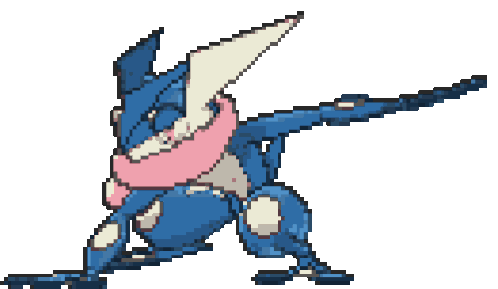
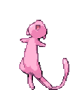

  

<h2>
  
  / About me /
</h2>

<ul>
  <li>💻 I'm a Frontend Developer.</li>
  <li>🚀 I'm an Industrial Manager.</li>
  <li>👨‍👩‍👧‍👧 I like working in a team.</li>
  <li>🤘🏽🎸 I like classic rock.</li>
  <li>☕ I love coffee.</li>
</ul>

<h2>
  
  / Current skills /
</h2>

  
  

<h2>
  
  / How to reach me /
</h2>

  
  

